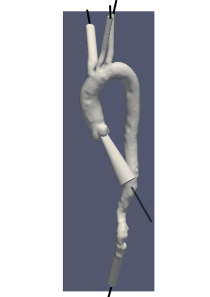

### Overview

`svFSI`的流固耦合模块是基于有限元整体求解的强耦合求解模块，因此求解速度较慢，所费计算资源较大，没有相关研究要求的没必要使用本模块。

### 算例结构

一个FSI求解血管流动的算例结构如下

```bash
├── input.dat
├── mesh
│   ├── fluid
│   │   ├── mesh-complete.mesh.vtu
│   │   └── mesh-surfaces
│   │       ├── fluid_interface.vtp
│   │       ├── inlet.vtp
│   │       ├── outlet1.vtp
│   │       ├── outlet2.vtp
│   │       ├── outlet3.vtp
│   │       └── outlet4.vtp
│   └── solid
│       ├── mesh-complete.mesh.vtu
│       └── mesh-surfaces
│           ├── outwall.vtp
│           ├── solid_interface.vtp
│           ├── wall1.vtp
│           ├── wall2.vtp
│           ├── wall3.vtp
│           ├── wall4.vtp
│           └── wall5.vtp
└── svFSI.inp
```

- `input.dat`是入口流量数据（反一个符号，傅立叶）
- `mesh`文件夹里是网格文件，流体固体的体网格，以及边界的面网格
- `svFSI.inp`是输入配置文件

### 入口流量

### 网格模型

下图是网格模型图


### 配置文件

下面是对于FSI求解的配置文件详解

```yaml
#----------------------------------------------------------------
# General simulation parameters

Continue previous simulation: 1     # 是否断点续算，1 是 0 否
Number of spatial dimensions: 3     # 维度 2维 3维
Number of time steps: 6000          # 求解步数 共6000步
Time step size: 0.001               # 时间步间 0.001
Spectral radius of infinite time step: 0.50
Searched file name to trigger stop: STOP_SIM    # 断点续算保存文件名

Save results to VTK format: 1       # 结果保存为VTK格式
Name prefix of saved VTK files: result  # 计算结果名
Increment in saving VTK files: 10       # 每多少步保存结果
Start saving after time step: 1         # 从第几步开始保存结果

Increment in saving restart files: 10     # 每多少步保存断点续算文件
Convert BIN to VTK format: 0            # 讲断点续算文件保存为VTK格式还是二进制文件

Verbose: 1                      # 是否打印较多信息？
Warning: 0                      # 警告信息
Debug: 0                        # debug模式

#----------------------------------------------------------------
# Mesh data
Add mesh: lumen {
   Mesh file path:    ./fluid/mesh-complete.mesh.vtu
   Add face: lumen_inlet {
      Face file path: ./fluid/mesh-surfaces/inlet.vtp
   }
   Add face: lumen_outlet1 {
      Face file path: ./fluid/mesh-surfaces/outlet1.vtp
   }
   Add face: lumen_outlet2 {
      Face file path: ./fluid/mesh-surfaces/outlet2.vtp
   }
   Add face: lumen_outlet3 {
      Face file path: ./fluid/mesh-surfaces/outlet3.vtp
   }
   Add face: lumen_outlet4 {
      Face file path: ./fluid/mesh-surfaces/outlet4.vtp
   }
   Add face: lumen_wall {
      Face file path: ./fluid/mesh-surfaces/fluid_interface.vtp
   }
   Domain: 1            # 区域号，流体为1号，固体为2号
   
   # m to cm
   # 网格文件的几何量纲是米，svFSI里都是CGS单位制：克、厘米等作为单位
   Mesh scale factor:   100
}

Add mesh: wall {
   Mesh file path:    ./solid/mesh-complete.mesh.vtu
   Add face: fixed_wall1 {
      Face file path:  ./solid/mesh-surfaces/wall1.vtp
   }
   Add face: fixed_wall2 {
      Face file path:  ./solid/mesh-surfaces/wall2.vtp
   }
   Add face: fixed_wall3 {
      Face file path:  ./solid/mesh-surfaces/wall3.vtp
   }
   Add face: fixed_wall4 {
      Face file path:  ./solid/mesh-surfaces/wall4.vtp
   }
   Add face: fixed_wall5 {
      Face file path:  ./solid/mesh-surfaces/wall5.vtp
   }
   Add face: wall_inner {
      Face file path: ./solid/mesh-surfaces/solid_interface.vtp
   }
   Add face: wall_outer {
      Face file path: ./solid/mesh-surfaces/outwall.vtp
   }
   Domain: 2            # 区域号，流体为1号，固体为2号
   # m to cm
   Mesh scale factor:   100
}

#----------------------------------------------------------------
# Projections   # 流固耦合必备操作
Add projection: wall_inner {
   Project from face: lumen_wall
   Projection tolerance: 1e-6
}


#----------------------------------------------------------------
# Equations   # 求解方程 FSI
Add equation: FSI {
   Coupled: 1
   Min iterations: 3
   Max iterations: 20
   Tolerance: 1e-4
    # Domain号与上面网格处填写的对应
   Domain: 1 {
      Equation: fluid
      Density: 1.06
      Viscosity: Constant {Value: 0.04}
      Backflow stabilization coefficient: 0.2
   }
    # Domain号与上面网格处填写的对应
   Domain: 2 {
      Equation: struct
      Density: 1.2
      Poisson ratio: 0.49
      Elasticity modulus: 8000000.0
      Constitutive model: nHK
      Dilational penalty model: Quad
   }
    # 输出结果
   Output: Spatial {
      Velocity: t
      Pressure: t
      Displacement: t
      WSS: t
      VonMises_stress: t
      Vorticity: t
      Jacobian: t
   }
    # FSI中流体位移和固体位移，区分开来
   Output: Alias {
      Displacement: FS_Displacement
   }
    # FSI的求解算法不用改
   LS type: GMRES
   {
      Preconditioner:      FSILS
      Max iterations:      100
      Tolerance:           1D-5
      Krylov space dimension: 50
   }

   Initialize RCR from flow: t
   Add BC: lumen_inlet {
      Type: Dir
      Time dependence: Unsteady
      Temporal values file path: input.dat
      Profile: Parabolic
      Impose flux: t
   }
    # RCR边界写法，注意单位
   Add BC: lumen_outlet1 {
      Type: Neu
      Time dependence: RCR
      RCR values: (1040.0, 8.74D-5, 16300.0)
      Distal pressure: 0.0
      Initial pressure: 140000.0
   }

   Add BC: lumen_outlet2 {
      Type: Neu
      Time dependence: RCR
      RCR values: (1190.0, 7.7D-5, 18400.0)
      Distal pressure: 0.0
      Initial pressure: 140000.0
   }

   Add BC: lumen_outlet3 {
      Type: Neu
      Time dependence: RCR
      RCR values: (970.0, 9.34D-5, 15200.0)
      Distal pressure: 0.0
      Initial pressure: 140000.0
   }

   Add BC: lumen_outlet4 {
      Type: Neu
      Time dependence: RCR
      RCR values: (188.0, 48.2D-5, 2950.0)
      Distal pressure: 0.0
      Initial pressure: 140000.0
   }

   Add BC: fixed_wall1 {
      Type: Dir
      Value: 0.0
      Impose on state variable integral: t
   }
   Add BC: fixed_wall2 {
      Type: Dir
      Value: 0.0
      Impose on state variable integral: t
   }
   Add BC: fixed_wall3 {
      Type: Dir
      Value: 0.0
      Impose on state variable integral: t
   }
   Add BC: fixed_wall4 {
      Type: Dir
      Value: 0.0
      Impose on state variable integral: t
   }
   Add BC: fixed_wall5 {
      Type: Dir
      Value: 0.0
      Impose on state variable integral: t
   }
}

# 网格移动求解设置
Add equation: mesh {
   Coupled: 1
   Min iterations: 2
   Max iterations: 20
   Tolerance: 1e-4
   Poisson ratio: 0.3

   LS type: CG {
      Preconditioner: FSILS
      Tolerance: 1e-4
   }

   Output: Spatial {
      Displacement: t
   }

   Add BC: lumen_inlet {
      Type: Dir
      Value: 0.0
   }

   Add BC: lumen_outlet1 {
      Type: Dir
      Value: 0.0
   }

   Add BC: lumen_outlet2 {
      Type: Dir
      Value: 0.0
   }

   Add BC: lumen_outlet3 {
      Type: Dir
      Value: 0.0
   }

   Add BC: lumen_outlet4 {
      Type: Dir
      Value: 0.0
   }
}
```
